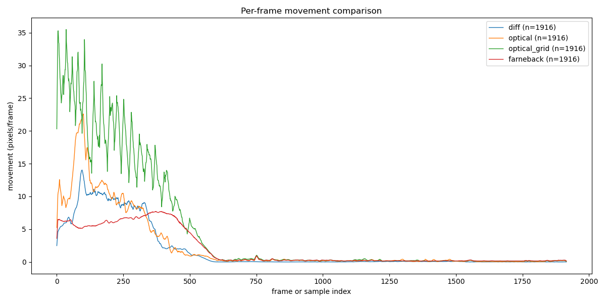
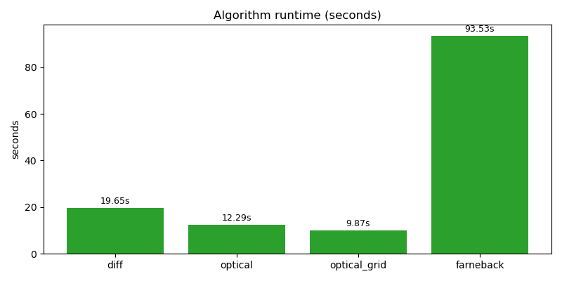

# Camera Movement Detection - 알고리즘 설명서

아래 두 그림은 이 저장소에서 비교한 알고리즘들의 대표 결과입니다 — 왼쪽은 프레임별 속도 시계열을 여러 알고리즘으로 겹쳐 그린 `velocities_combined.png`, 오른쪽은 각 알고리즘의 실행시간을 비교한 `runtimes.png`입니다.





이 저장소에는 영상 기반의 카메라/장면 내 움직임(속도) 탐지를 위한 여러 알고리즘이 포함되어 있습니다. 여기서는 네 가지 알고리즘(프레임 차분, 특징점 기반 광류, 격자 기반 광류, Farneback dense)의 동작 원리, 구현 포인트, 장단점 및 사용 예시를 설명합니다.

---

## 1) 원본 알고리즘: Farneback (Dense Optical Flow) 기반 ROI 평균
설명:
- 입력: `prev_gray`, `curr_gray` (그레이스케일 전후 프레임), `roi_mask` (ROI 영역을 나타내는 0/1 바이너리 마스크)
- 내부 동작: Farneback 알고리즘으로 각 픽셀의 흐름 벡터(flow)를 구한 뒤, x/y 성분으로부터 크기(magnitude)를 계산합니다. ROI 마스크로 크기를 마스킹한 후 ROI 내부 픽셀들의 평균을 반환하여 '움직임 정도'를 산출합니다.

대표 함수 (개념 코드):

```python
def compute_optical_flow_with_mask(prev_gray, curr_gray, roi_mask):
  """Farneback 광류 → 크기(magnitude)의 ROI 평균값으로 움직임 정도 산출"""
  flow = cv2.calcOpticalFlowFarneback(
    prev_gray, curr_gray, None,
    pyr_scale=0.5, levels=1, winsize=9,
    iterations=1, poly_n=3, poly_sigma=0.9, flags=0
  )
  mag, _ = cv2.cartToPolar(flow[..., 0], flow[..., 1])
  # roi_mask는 0/1 바이너리여야 평균이 정확함
  masked_mag = mag * roi_mask
  mean_movement = np.sum(masked_mag) / (np.sum(roi_mask) + 1e-6)
  return mean_movement
```
```python
def compute_optical_flow_with_mask(prev_gray, curr_gray, roi_mask):
  """Farneback 광류 → 크기(magnitude)의 ROI 평균값으로 움직임 정도 산출"""
  flow = cv2.calcOpticalFlowFarneback(
    prev_gray, curr_gray, None,
    pyr_scale=0.5, levels=1, winsize=9,
    iterations=1, poly_n=3, poly_sigma=0.9, flags=0
  )
  mag, _ = cv2.cartToPolar(flow[..., 0], flow[..., 1])
  # roi_mask는 0/1 바이너리여야 평균이 정확함
  masked_mag = mag * roi_mask
  mean_movement = np.sum(masked_mag) / (np.sum(roi_mask) + 1e-6)
  return mean_movement
```
# Camera Movement Detection - 알고리즘 설명서

이 저장소에는 영상 기반의 카메라/장면 내 움직임(속도) 탐지를 위한 여러 알고리즘이 포함되어 있습니다. 여기서는 네 가지 알고리즘(프레임 차분, 특징점 기반 광류, 격자 기반 광류, Farneback dense)의 동작 원리, 구현 포인트, 장단점 및 사용 예시를 설명합니다.

---

## 1) 원본 알고리즘: Farneback (Dense Optical Flow) 기반 ROI 평균

설명:
- 입력: `prev_gray`, `curr_gray` (그레이스케일 전후 프레임), `roi_mask` (ROI 영역을 나타내는 0/1 바이너리 마스크)
- 내부 동작: Farneback 알고리즘으로 각 픽셀의 흐름 벡터(flow)를 구한 뒤, x/y 성분으로부터 크기(magnitude)를 계산합니다. ROI 마스크로 크기를 마스킹한 후 ROI 내부 픽셀들의 평균을 반환하여 '움직임 정도'를 산출합니다.

대표 함수 (개념 코드):

```python
def compute_optical_flow_with_mask(prev_gray, curr_gray, roi_mask):
    """Farneback 광류 → 크기(magnitude)의 ROI 평균값으로 움직임 정도 산출"""
    flow = cv2.calcOpticalFlowFarneback(
        prev_gray, curr_gray, None,
        pyr_scale=0.5, levels=1, winsize=9,
        iterations=1, poly_n=3, poly_sigma=0.9, flags=0
    )
    mag, _ = cv2.cartToPolar(flow[..., 0], flow[..., 1])
    # roi_mask는 0/1 바이너리여야 평균이 정확함
    masked_mag = mag * roi_mask
    mean_movement = np.sum(masked_mag) / (np.sum(roi_mask) + 1e-6)
    return mean_movement
```

주의/팁:
- `roi_mask`는 0/1로 되어 있어야 하며, 정수나 float 마스크가 들어오면 평균 해석에 주의해야 합니다. (권장: `roi_mask = (roi_mask > 0).astype(np.uint8)`)
- 이 값은 픽셀 단위의 평균 이동 크기(단위: 픽셀/프레임)이며, 물리적 속도(예: m/s)로 변환하려면 카메라의 픽셀-실제거리 변환과 프레임레이트(FPS)를 사용해야 합니다.
- Farneback은 dense flow(모든 픽셀)를 계산하므로 넓은 영역의 움직임을 파악하는 데 유리하지만, 노이즈에 민감하고 계산 비용이 큽니다.

장점:
- ROI 전체의 흐름 분포를 반영하므로 넓은 영역의 평균적 움직임을 측정하기 좋음.

단점:
- 연산 비용이 높고, 텍스처가 적은 영역에서는 불안정할 수 있음.

---

## 2) 제안된 방법: 특징점 기반 광류 (Sparse Optical Flow, Lucas–Kanade)

설명:
- 단계: 먼저 Shi–Tomasi 등으로 '좋은 특징점(코너)'을 검출한 뒤, 프레임 간에 `cv2.calcOpticalFlowPyrLK`로 각 특징점의 이동(변위)을 계산합니다. 그런 다음 ROI 위의 특징점들만 골라 이동 크기(예: sqrt(dx^2+dy^2) 또는 x방향 이동 평균)를 집계(평균/중앙값)하여 움직임 정도를 산출합니다.

간단한 구현 아이디어:

```python
# p0 = cv2.goodFeaturesToTrack(prev_gray, ...)
# p1, st, err = cv2.calcOpticalFlowPyrLK(prev_gray, curr_gray, p0, None, ...)
# st==1인 점만 사용
displacements = np.linalg.norm(good_new - good_old, axis=1)
# ROI 마스크가 있다면 각 점의 좌표가 ROI 내부인지 체크해서 필터링
mean_disp = np.mean(displacements_in_roi)
```

특징점 기반 광류가 맞는가?
- 네. 제안하신 방법은 표준적이고 타당합니다. Lucas–Kanade 방식의 sparse optical flow는 계산 비용이 낮고, 신뢰할 수 있는 피처(코너 등)만 추적하므로 잡음에 더 강합니다. 단, 특징점이 충분하지 않거나 ROI 안에 특징이 적으면 정보가 부족할 수 있습니다.

장점:
- 빠르고(계산 비용 적음), 잡음에 비교적 강함. 객체의 주요 포인트 이동을 직접적으로 측정.

단점:
- ROI 안에 추적 가능한 특징점이 적으면 측정 불안정.
- 장면 전체의 흐름을 보지 못하고 '선택된 점들'만 평가.

---

## 3) 프레임 차분 기반 간단 방법 (레퍼런스 구현: `utils/algorithms.py`의 `diff_based_velocity`)

설명:
- 두 프레임의 절댓값 차이를 이진화해 윤곽을 추출한 뒤, 큰 윤곽(면적 임계값 이상)을 검출하고 윤곽의 바운딩 박스 위치 x 좌표 변화량을 기록해 간단히 '속도(픽셀/프레임)'로 계산합니다.

장단점:
- 장점: 구현이 간단하고 빠름. 특정 상황에서는 실용적.
- 단점: 객체 분리/겹침, 그림자, 조명 변화에 민감함. 복잡한 장면에서 오탐(노이즈)이 많을 수 있음.

---

## 4) 언제 어떤 방식을 쓰는가?
- ROI가 넓고 전체적인 흐름을 알고 싶다면: Dense (Farneback). 하지만 실시간 제약이 있거나 계산 리소스가 적다면 sparse를 고려하세요.
- ROI가 텍스처가 부족하거나 특징점이 드문 영역이면 dense가 더 안정적일 수 있음.
- 속도의 안정성(잡음 제거)을 위해 평균 대신 중앙값(median)이나 상위/하위 컷(cut) 후 평균을 쓰는 것이 좋습니다.

---

## 5) 실제 적용 시 고려사항 & 팁
- 프레임 간 시간 차이를 고려하여 픽셀/프레임 → 픽셀/초(또는 물리 단위)로 변환하려면 FPS를 곱하세요: pixels_per_second = pixels_per_frame * fps
- ROI 마스크는 반드시 바이너리(0/1)로 맞춰 쓰세요. (또는 `masked_mag[roi_mask>0]`으로 평균)
- 외란(카메라 흔들림 등)을 제거하려면 전역 카메라 운동 추정(예: RANSAC으로 호모그래피/기본행렬 추정 후 보정) 또는 고정 배경 모델링을 추가하세요.
- 이상치를 제거하려면 이동값의 분포를 보고 `np.median` 또는 `np.clip`을 사용하세요.

---

## 6) 본 저장소와의 연결
- 현재 `utils/algorithms.py`에는 다음 함수들이 들어있습니다:
  - `diff_based_velocity(video_path, ...)` — 프레임 차분 방법
  - `optical_flow_velocity(video_path, ...)` — 특징점 기반(LK) 방식
  - `available_methods()` — 사용 가능한 메서드 맵 반환
- 원본 Farneback dense 방식을 별도 함수로 추가하려면 `utils/algorithms.py`에 `farneback_flow_roi_mean(prev_gray, curr_gray, roi_mask, params...)` 같은 함수 형태로 넣어 두면 `main.py`/`test_script`에서 쉽게 호출할 수 있습니다.

---

## 7) 요약 (한줄)
- 주어진 `compute_optical_flow_with_mask` (Farneback dense magnitude ROI 평균)은 올바른 '움직임 크기' 측정 방식이며, 제안된 특징점 기반(스파스) 광류 분석 또한 타당합니다. 둘은 서로 보완적이므로 실험적으로 비교하여 상황에 맞는 방법을 선택하세요.


## 8) 저장소에 포함된 구현(요약)

이 저장소에는 현재 실험/비교용으로 다음 4가지 알고리즘이 구현되어 있습니다:

- `diff_v2_magnitude` (`utils/algorithms.py`): 프레임 간 밝기 차이의 평균(또는 ROI 내 평균)으로 움직임 점수 산출. (프레임별 1개 값)
- `optical_flow_feature` (`utils/algorithms.py`): Shi–Tomasi로 특징점 검출 후 Lucas–Kanade로 추적한 특징점들의 displacement 평균(프레임별) — 샘플은 특징점별 누적(`sample_count`)로 제공됨.
- `optical_flow_grid` (`utils/algorithms.py`): 프레임을 격자(grid)로 나누어 각 그리드 포인트를 LK로 추적해 프레임별 평균 이동을 계산.
- `farneback` (`utils/algorithms.py`): Farneback dense optical flow를 ROI에 대해 계산. 성능을 위해 내부적으로 프레임을 축소해 계산(설정에 따라 scale 사용)하며, 결과는 원래 픽셀 단위로 보정됩니다.

각 함수는 결과로 다음 주요 필드를 반환합니다:

- **`sample_count`**: 알고리즘이 생성한 개별 velocity 샘플 총합(추적점/검출 수의 합).
- **`frame_count`**: 프레임(또는 프레임 쌍) 단위로 집계한 값의 길이(= len(per-frame series)).
- **`velocities`**: 원시 샘플(또는 프레임별 값) 리스트.
- **`per_frame`** (가능한 경우): 프레임별 집계(평균 또는 0으로 채운 리스트) — 프레임 기준 비교용으로 사용하세요.
- **`runtime`**: 알고리즘 실행 소요시간(초).

---

## 9) 결과 파일 및 대표 figure

- **Velocity plots (per algorithm)**: `test_script/velocities_<method>.png` — 각 알고리즘의 프레임별 움직임(스무스한 시각화) 저장. 예: `velocities_diff.png`, `velocities_optical.png`, `velocities_farneback.png`, `velocities_optical_grid.png`.
- **Combined velocity plot**: `test_script/velocities_combined.png` — 여러 알고리즘의 per-frame 시리즈를 한 그래프에 겹쳐 비교.
- **Runtimes barplot**: `test_script/runtimes.png` — 각 알고리즘의 실행 시간(초)을 막대그래프로 저장.

위 세 파일(`velocities_combined.png`, `runtimes.png`, `velocities_<method>.png`)을 대표 figure로 Git에 업로드하면, 비교 결과(시간 대비 성능, 프레임별 속도 추이)를 한눈에 전달할 수 있습니다.

---

## 10) 사용 방법 (간단)

- 환경 준비: `opencv-python`과 `matplotlib`가 필요합니다. (패키지 설치 예)

```bash
pip install opencv-python matplotlib pyyaml
```

- 전체 비교 실행 (기본 비디오 `data/signal_test2.mp4` 사용):

```bash
PYTHONPATH=$(pwd) python3 test_script/run_comparison.py
```

- 실행 결과는 `test_script/` 폴더에 PNG 파일로 저장됩니다. Farneback은 설정된 축소(scale)에 따라 시간이 걸릴 수 있습니다(설정 파일 `config.yaml`에서 `farneback.resize_scale` 확인).

---

## 11) 추천 비교 지표 및 해석

- 프레임 기준 비교: `per_frame` 시리즈(또는 `frame_count`)로 비교하세요. `sample_count`는 알고리즘마다 의미가 달라 바로 비교하면 오해가 생깁니다.
- 이상치 처리: 프레임별 중앙값(`median`) 또는 상·하위 컷(cut)을 사용해 이상치 영향을 줄이세요.
- 시간 대비 정확도: `runtimes.png`와 `velocities_combined.png`를 함께 보며 어떤 알고리즘이 현실적 제약(실시간, 배치 처리)에 더 적합한지 판단하세요.


